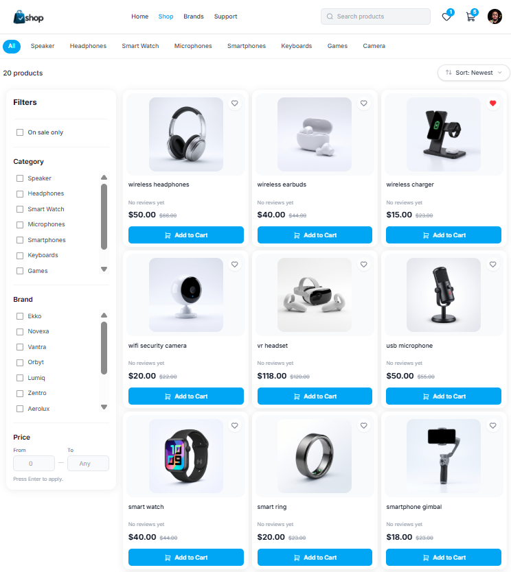
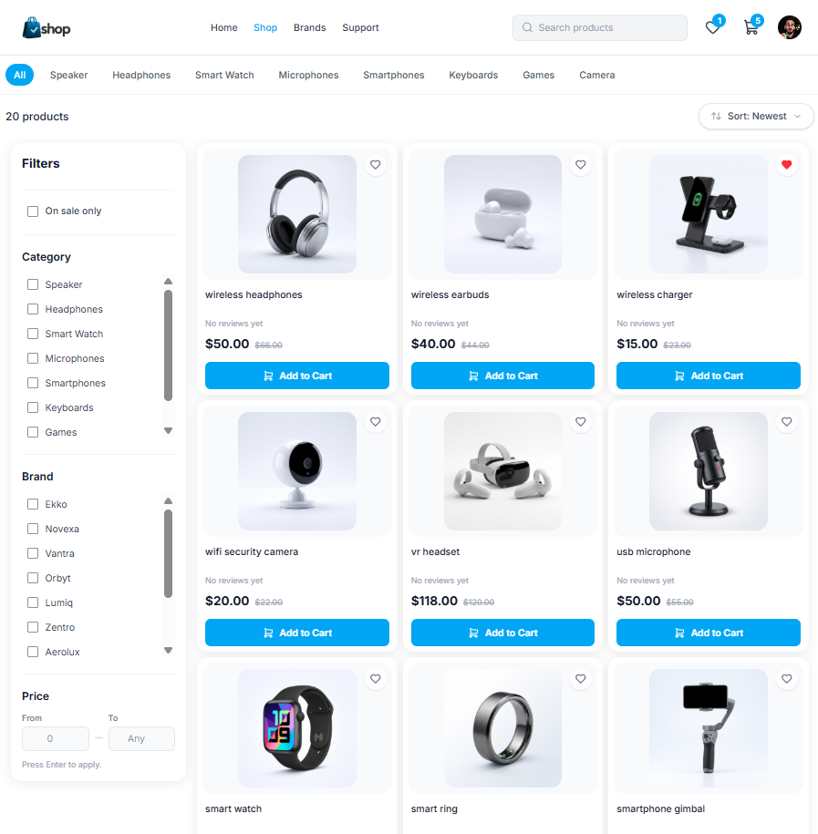
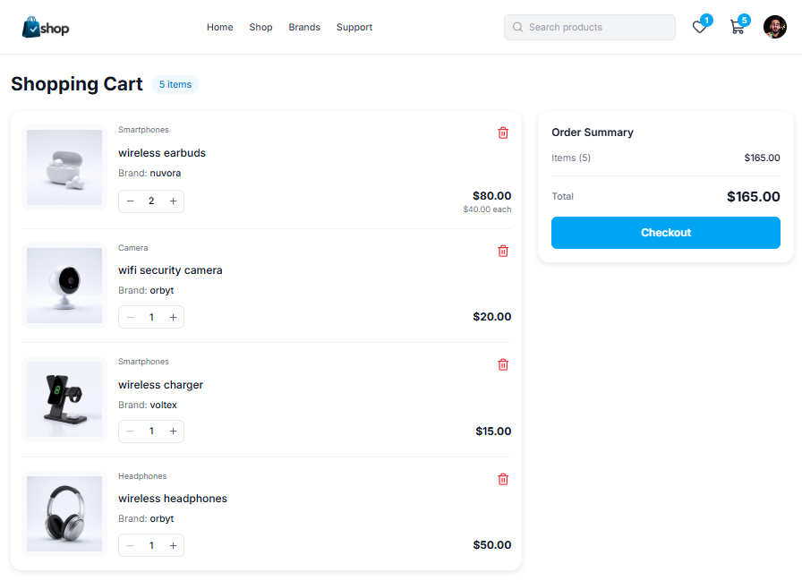
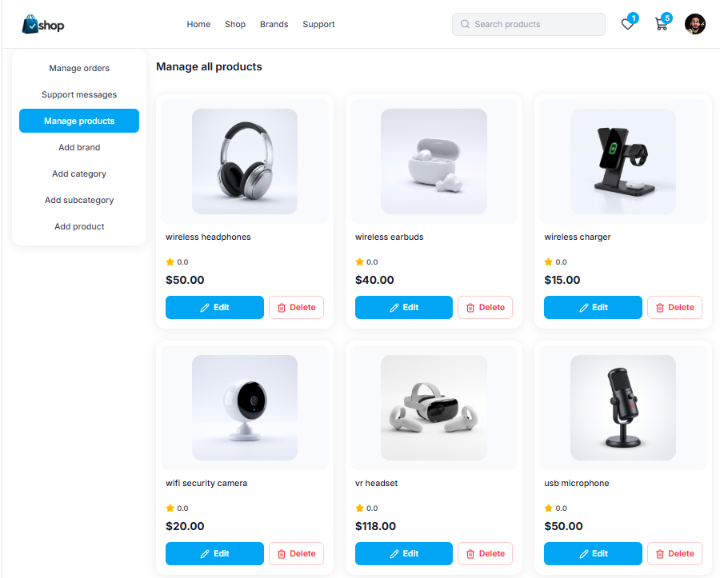

# 🛍️ Shop — Full-Stack E-Commerce App

A full-stack e-commerce web application built with **React + TypeScript** on the frontend and **Node.js + Express + MongoDB** on the backend, deployed on Vercel with a MongoDB Atlas database.

**🔗 Live demo:** https://ecommerce-shop-eight-sigma.vercel.app
**🔗 API:** https://ecommerce-api-xi-nine.vercel.app

> ⚠️ The API runs on serverless functions (free tier). The first request after a period of inactivity may take ~0.5s longer (cold start).

---

## 📸 Screenshots

| Home | Shop |
|---|---|
|  |  |

| Product details | Cart |
|---|---|
|  |  |

| Admin dashboard |
|---|
|  |

---

## 🧪 Demo account

<!-- Create a regular (non-admin) demo customer account and put it here.
     Never publish admin credentials in a public repository. -->

| Role | Email | Password |
|---|---|---|
| Customer | `adam2010isawi@gmail.com` | `123456` |

---

## ✨ Features

### Customer
- Browse products with filters (category, brand, on-sale) and sorting
- Product details with ratings and reviews
- Shopping cart and wishlist
- Saved addresses and order placement / order history
- Newsletter subscription and contact form
- Responsive design (mobile → desktop)

### Admin
- Manage products, categories, subcategories and brands
- Image uploads stored on Cloudinary
- Manage orders and customer messages

### Security & reliability
- JWT authentication stored in **httpOnly cookies** (works cross-domain between frontend and API)
- Passwords hashed with **bcrypt**
- Security headers with **Helmet**
- **Rate limiting** on the whole API, with stricter limits on login, register, password change, contact and newsletter
- Strict **CORS** allow-list
- Centralized error handling with consistent JSON error responses
- Fails fast at startup if required environment variables are missing

---

## 🛠️ Tech stack

| Layer | Technologies |
|---|---|
| Frontend | React, TypeScript, Vite, Tailwind CSS, React Router |
| Backend | Node.js, Express 5, TypeScript, Mongoose |
| Database | MongoDB Atlas |
| Media | Cloudinary |
| Email | Nodemailer |
| Deployment | Vercel (frontend + serverless API) |

---

## 🏗️ Architecture & deployment notes

```
Browser ──► Vercel (frontend, static)
   │
   └────► Vercel Function – Paris (cdg1) ──► MongoDB Atlas – Paris (eu-west-3)
                                         └─► Cloudinary (images)
```

A few decisions worth mentioning:

- **Co-located regions.** The API function initially ran in Washington (`iad1`) while the database is in Paris, so every query crossed the Atlantic. Moving the function to Paris (`cdg1`) reduced typical API response times from **~240–490 ms to ~80–150 ms**.
- **Faster cold starts.** Index synchronization (`createIndexes`) runs only in development. On serverless it ran on every cold start; removing it from production cut the first-request time from **~2.3 s to ~0.4–0.5 s**.
- **Rate limiting on serverless.** Limits use an in-memory store, so each function instance keeps its own counter. This is acceptable for a demo; a shared store (e.g. Redis) would be needed for strict limits in production.
- **Monorepo.** One repository, two independent Vercel projects (`ecomme` for the frontend, `ecommeB` for the API).
- **Request deduplication.** Several components fetched categories and brands independently, sending duplicate requests on every page. A small shared cache (`cachedGet`) now serves them once per session window and is invalidated after admin changes.

---

## 📁 Project structure

```
E-commerce-1/
├── ecomme/          # Frontend (React + Vite)
│   └── src/
│       ├── Api/         # API base URL and requests
│       ├── Components/  # Reusable UI components
│       ├── Page/        # Route pages
│       └── images/
└── ecommeB/         # Backend (Express API)
    └── src/
        ├── routes/
        ├── middlewares/
        ├── scripts/     # seed admin, stock helpers
        ├── utils/
        └── index.ts
```

---

## 🚀 Getting started (local)

### Prerequisites
- Node.js **20.11+**
- A MongoDB database (local or Atlas)
- A Cloudinary account (for image uploads)

### 1. Clone

```bash
git clone https://github.com/vannbo-93/E-commerce-1.git
cd E-commerce-1
```

### 2. Backend

```bash
cd ecommeB
npm install
cp .env.example .env   # then fill in the values
npm run seed:admin     # creates the admin account from ADMIN_* variables
npm run dev            # http://localhost:3001
```

### 3. Frontend

```bash
cd ecomme
npm install
npm run dev            # http://localhost:5173
```

By default the frontend calls `http://localhost:3001`. To point it elsewhere, create `ecomme/.env`:

```env
VITE_API_URL=http://localhost:3001
```

---

## 🔐 Environment variables (backend)

| Variable | Description |
|---|---|
| `MONGO_URI` | MongoDB connection string (include the database name) |
| `JWT_SECRET` | Secret used to sign auth tokens |
| `CLIENT_ORIGIN` | Allowed frontend origin(s) for CORS, comma-separated |
| `FRONTEND_URL` | Public frontend URL (used in emails/links) |
| `API_BASE_URL` | Public API URL |
| `ADMIN_USERNAME` / `ADMIN_EMAIL` / `ADMIN_PASSWORD` | Used by `npm run seed:admin` |
| `CLOUDINARY_CLOUD_NAME` / `CLOUDINARY_API_KEY` / `CLOUDINARY_API_SECRET` | Image storage |
| `MAIL_FROM` / `SUPPORT_EMAIL` | Email sender and support address |
| `NEWSLETTER_SECRET` | Secret for newsletter confirmation links |
| `RATE_LIMIT_DISABLED` | Set to `true` only for automated tests |

---

## 📜 Available scripts (backend)

| Script | Description |
|---|---|
| `npm run dev` | Start the API in watch mode |
| `npm run build` | Compile TypeScript to `dist/` |
| `npm start` | Run the compiled build |
| `npm run typecheck` | Type-check without emitting |
| `npm run seed:admin` | Create the admin account |
| `npm run set:stock` | Stock helper script |

---

## 🗺️ Roadmap

- [ ] Extend client-side caching to all data (e.g. TanStack Query)
- [ ] Skeleton loaders
- [ ] Code-splitting routes to reduce the main bundle size
- [ ] Online payments

---

## 👤 Author

**Mohamed El Aissaoui** — [LinkedIn](https://www.linkedin.com/in/mohamed-el-aissaoui-101125335/) · [GitHub](https://github.com/vannbo-93)